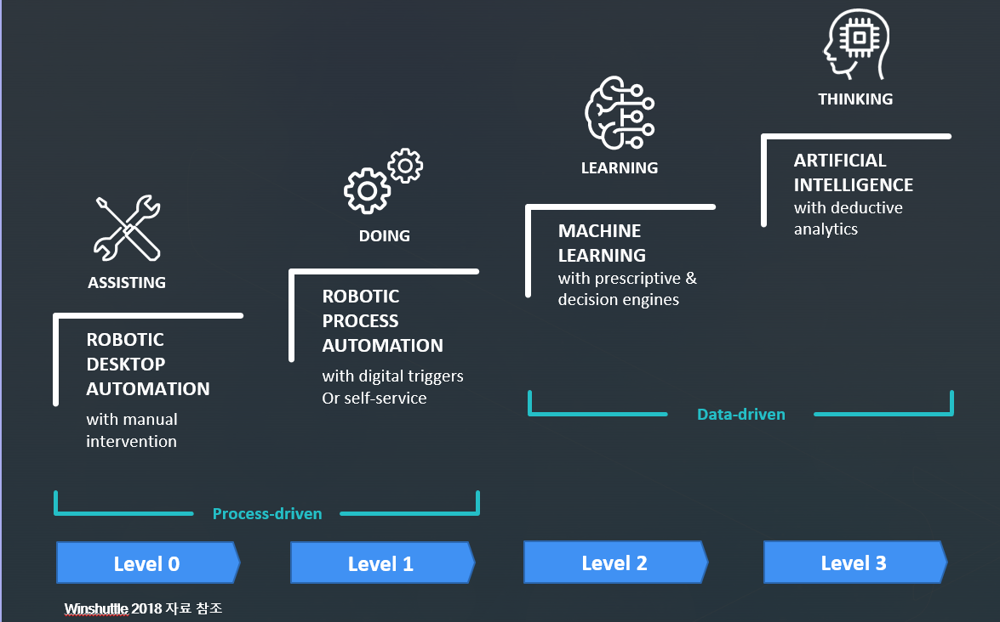

# 확장 RPA Solution

## RPA(Robotic Process Automation)란?

### **소프트웨어 로봇이 인간의 업무를 대신 수행하는 것**
**사람이 컴퓨터로 처리하는 ‘ 반복적’, ‘규칙적’, ‘대량의 작업’을 자동으로 처리하는 소프트웨어**

**소프트웨어와 인공지능 기술 기반으로 업무 프로세스를 자동화하는 기술**

## RPA 적용 대상업무
**단순반복 업무의 자동화를 통해 핵심적인 고 부가가치 업무에 집중**

## RPA 발전단계 분류

### Level0(ASSISTING) : 
 - 사전에 정의된 프로그램에 의해 정해진 작업만 수행
 - DB 접속 및 데이터 추출
 - Single Application
 - Macro Application

### Level1(DOING) : 
 - 정형화된 규칙 기반의 단순 반복적인 업무 처리
 - 시스템 간 정형화된 데이터 입출력 업무 처리
 - 적용 AI 기술
   - 초보적 수준의 OCR 기술

### Level2(LEARNING) : 
 - 고차원적 데이터 분석 및 처리
 - 적용 AI 기술
   - 이미지 인식 기술
   - 향상된 OCR 기술
   - 음성 인식 기술
   - 자연어 처리 기술
   - 심층 학습 기술 (Deep Learning)
   - 강화 학습 기술(Reinforcement Learning)

### Level3(THINKING) : 
 - 전략, 예산, 경영 의사결정 등 인지적 의사결정
 - 확률 및 통계 기반 자기학습
 - 적용 AI 기술
   - Sensing AI 연계
   - 분야별 전문가 AI 연계
   - 다양한 로봇 간 연계

## Automation Anywhere RPA Architecture

 **Automation Anywhere RPA 솔루션은 클라이언트 서버 형태이며, 크게 3가지 컴포넌트로 구성된다.**

 봇을 생성하는 **봇 크리에이터(Bot Creator)**, 이를 실행하는 **봇 러너(Bot Runner)**, 그리고 중앙에는 봇을 관리하고 통제하는 **컨트롤 룸(Control Room)** 이 위치한다.

 크리에이터와 러너로 실행되는 작업은 컨트롤 룸을 통해 관리되고 분석된다. 
 
 기업 고객은 여러 개의 봇 크리에이터와 봇 러너를 활용하며, 한대의 컨트롤 룸으로 1,000여 개의 봇 타스크를 관리할 수 있는 성능을 보장하고 있다. 