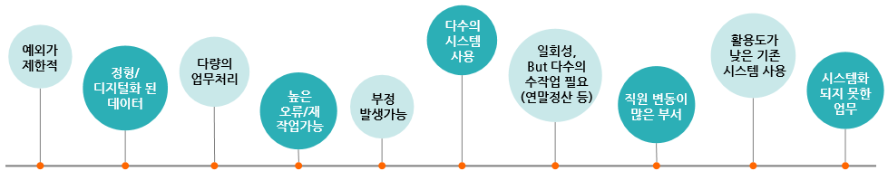

# 확장 RPA Solution

## RPA(Robotic Process Automation)란?

### **소프트웨어 로봇이 인간의 업무를 대신 수행하는 것**
**사람이 컴퓨터로 처리하는 ‘ 반복적’, ‘규칙적’, ‘대량의 작업’을 자동으로 처리하는 소프트웨어**

**소프트웨어와 인공지능 기술 기반으로 업무 프로세스를 자동화하는 기술**

## RPA 적용 대상업무
**단순반복 업무의 자동화를 통해 핵심적인 고 부가가치 업무에 집중**

## RPA 발전단계 분류
